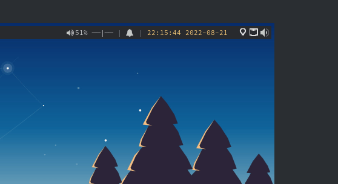

# battery-monitor
[](https://github.com/BiagioFesta/battery-monitor/actions/workflows/ci.yml)

Simple service for monitoring battery and sending notifications when capacity is lower than a threshold.

Typically, Linux Desktop Environments are shipped with an integrated system for battery monitoring. 
However, this minimal service come handy for those environments lacking of such functionality (for instance, [i3wm](https://i3wm.org/)).

<p align="center">

</p>

## Installation

### Requirements
* [Rust toolchain](https://rustup.rs/).
* [upower](https://upower.freedesktop.org/) (runtime dependency).
  * Generally an implementation of this service is already installed on the majority of the linux distributions.
* A notification daemon (runtime dependency). There are many (probably you already have one of them installed on your system).
  * See a list [here](https://wiki.archlinux.org/title/Desktop_notifications#Standalone).

### Compilation
* Clone and checkout the repository:
```
git clone https://github.com/BiagioFesta/battery-monitor.git && cd battery-monitor 
```

* Compile it:
```
cargo build --release
```

* Run the binary:
```
./target/release/battery-monitor
```

*The binary is standalone. You can copy it in a suitable directory and start it in the most convenient way for your environment.*

Alternatively, you can use a simple installer script. Click on the following dropdown section to expand it and find out how.

<br>

<details>
<summary><h4>Simple Installation</h4></summary>
As mentioned before, the result of the compilation produces a standalone binary. 
You can copy the binary itself and place it in the most convenient directory for your environment. 
<br>
Afterwards, you would need a mechanism to run the service (binary) at the startup of your desktop.

For example (*if you are using i3 window manager*), in your i3 configuration (generally, `~/.config/i3/config`):

```
exec --no-startup-id ~/path/to/binary/battery-monitor
```

If you, like me, are a little bit lazy, the repository contains a simple *bash script* that copies the binary to a destination directory, and it copies a systemd unit file (so you can launch the binary as a systemd service).

* Clone the repository:
```
git clone https://github.com/BiagioFesta/battery-monitor.git && cd battery-monitor 
```

* Run the installation script:
```
./install.sh --prefix ~/opt/battery-monitor
```
*(At the end, the script will ask to append the environment (`PATH`) in `~/.profile` and `~/.bashrc`.)*

* Install the systemd unit file:
```
ln -s ~/opt/binary-monitor/lib/systemd/user/battery-monitor.service ~/.config/systemd/user/
```

* Reload unit files:
```
systemctl --user daemon-reload
```

* Start the service:
```
systemctl --user start battery-monitor
```

* Check the service's status:
```
systemctl --user status battery-monitor
```
</details>
